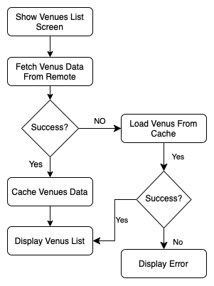

# Camlist
Camlist iOS Engineer position's task using Clean Architecture Concepts with MVVM

### Installation

Dependencies in this project are provided via Cocoapods. Please install all dependecies with

`
pod install
`

## Flowchart




## Model Specs

### Venues

| Property      | Type                |
|---------------|---------------------|
| `id`          | `String`            |
| `name`        | `String`            |
| `location`    | `Location`          |
| `categories`  | `[Category]`        |

### Location 

| Property           | Type               |
|--------------------|--------------------|
| `lat`              | `Double`           |
| `lng`              | `Double`           |
| `distance`         | `Int`              |
| `country`          | `String`           |
| `state`            | `String`           |
| `city`             | `String`           |
| `formattedAddress` | `[String]`         |


### Category

| Property      | Type                |
|---------------|---------------------|
| `id`          | `String`            |
| `name`        | `String`            |
| `pluralName`  | `String`            |
| `shortName`   | `String`            |

### Place Photo

| Property      | Type                |
|---------------|---------------------|
| `id`          | `String`            |
| `prefix`      | `String`            |
| `suffix`      | `String`            |
| `width`       | `Int`               |
| `height`      | `Int`               |


### Payload contract

```
GET venues/search

200 RESPONSE

{
	"venues": [
   "venues": [
            {
                "id": "52e5fdbb498e3e93281df168",
                "name": "Shahine Sq (ميدان شاهين)",
                "location": {
                    "lat": 30.051875200518353,
                    "lng": 31.213365241970838,
                    "distance": 113,
                    "city": "Al ‘Ajūzah",
                    "state": "Muḩāfaz̧at al Jīzah",
                    "country": "مصر",
                    "formattedAddress": [
                        "Al ‘Ajūzah",
                        "Muḩāfaz̧at al Jīzah",
                        "مصر"
                    ]
                },
                "categories": [
                    {
                        "id": "4bf58dd8d48988d164941735",
                        "name": "Plaza",
                        "pluralName": "Plazas",
                        "shortName": "Plaza",
                    }
                ],
            }
            ...
	]
}
```

---
